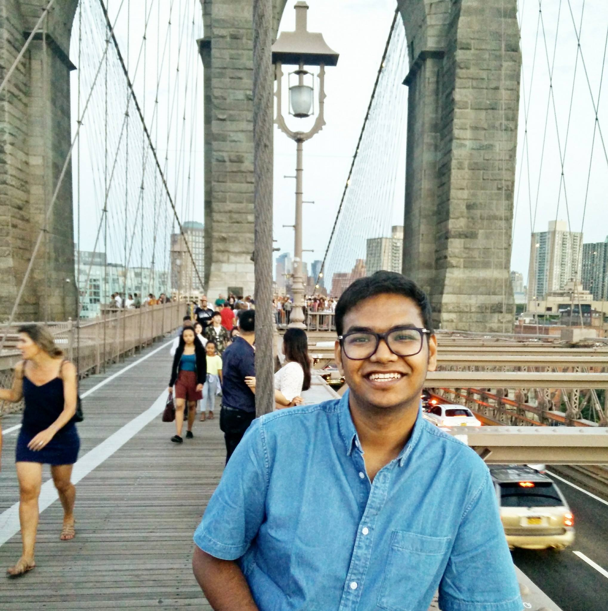

## Tuhin Chakrabarty

## About
I am a graduate student in Computer Science at Columbia University ,working under Professor Kathleen McKeown on Natural Language Processing . I closely collaborate with her PHD student Christopher Hidey and Professor Smaranda Muresan. I am highly interested in Computational models of Social Science , Argumentation Mining and Information Extraction . Prior to joining Grad school I was a backend engineer at UBER and Amazon .

My current research involves building better models for end to end argumentation mining of dialogic corpus . One of the end goals is also to identify semantics of argumentative components to help generate persuasive language . In Spring 2018
I also spent some time modelling discourse coherence and finding best sentence ordering in feedback messages.

 Paper from the Deep Learning course I took in Columbia <a href="https://github.com/tuhinjubcse/COMS4995/blob/master/Deep_Learning_Project_Report.pdf" title="Title">
[pdf] </a> .

I took  
- COMS 4705(Natural Language Processing) with Professor Michael Collins in Fall 2017  
- COMS E6998(NLP in Context : Computational Models of Social Meaning) with Smaranda Muresan in Spring 2018  
- I will be spending my summers at Amazon Alexa, Natural Language Understanding Group in Boston  as an Applied  Scientist Intern

## PUBLICATIONS
 
 1) IMHO Fine Tuning Improves Claim Detection <b> ,NAACL 2019 (Short)  </b> 
  <b> Tuhin Chakrabarty </b> ,Christopher Hidey , Kathy Mckweon  .

 
 
 2) [ColumbiaNLP] at SemEval-2018 Task [8]: Fact Checking in Community Question Answering Forums <b> ,SEMEVAL , NAACL 2019  </b> 
  <b> Tuhin Chakrabarty </b> ,Smaranda Muresan .   4th and 2nd place in SUBTASK A & B respectively  

 3) Robust Document Retrieval and Individual Evidence Modeling for Fact Extraction and Verification <b> ,Proceedings of the First Workshop on Fact Extraction and VERification (FEVER) ,EMNLP 2018  </b> 
  <b> Tuhin Chakrabarty </b> ,Tariq Alhindi , Smaranda Muresan  :- <a href="http://aclweb.org/anthology/W18-5521" title="Title"> [pdf] </a> .

 
  
 1) Discourse Relation Prediction: Revisiting Word Pairs with Convolutional Networks <b> ,Under Submission at IJCAI 2019   </b> 
   Siddharth Varia  ,Christopher Hidey , <b>Tuhin Chakrabarty</b>   .

